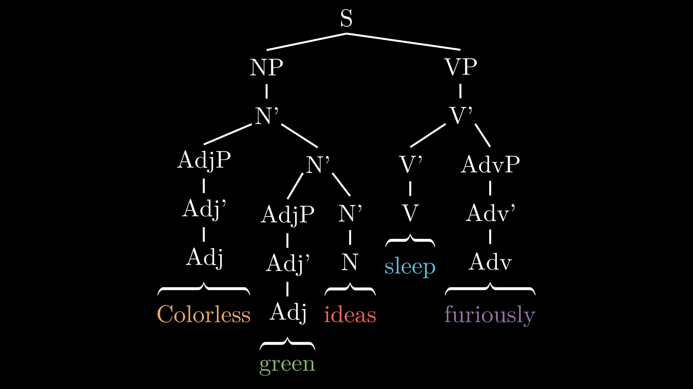

# manim-ling-syntax
Linguistics animations on syntax using manim

## Installation
Follow installation instructions [here](https://docs.manim.community/en/stable/installation.html). After installing manim and its necessary dependencies, run the following in your terminal:
```sh
manim -qh syntax.py EnglishSyntaxTree
```
The rendered animation should be located in `media/videos/syntax/1080p60/EnglishSyntaxTree.mp4` after rendering is complete.

Alternatively, to produce a static image from the last frame of the animation, run the following:
```sh
manim -qh -s syntax.py EnglishSyntaxTree
```
The rendered image should be located in `media/images/syntax`.

